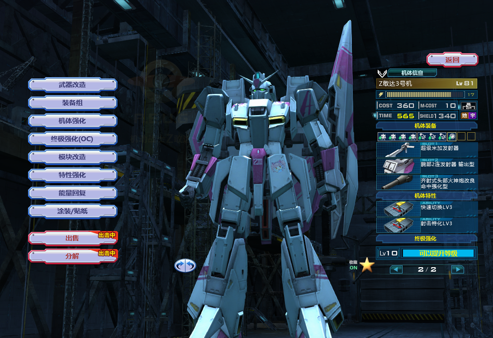
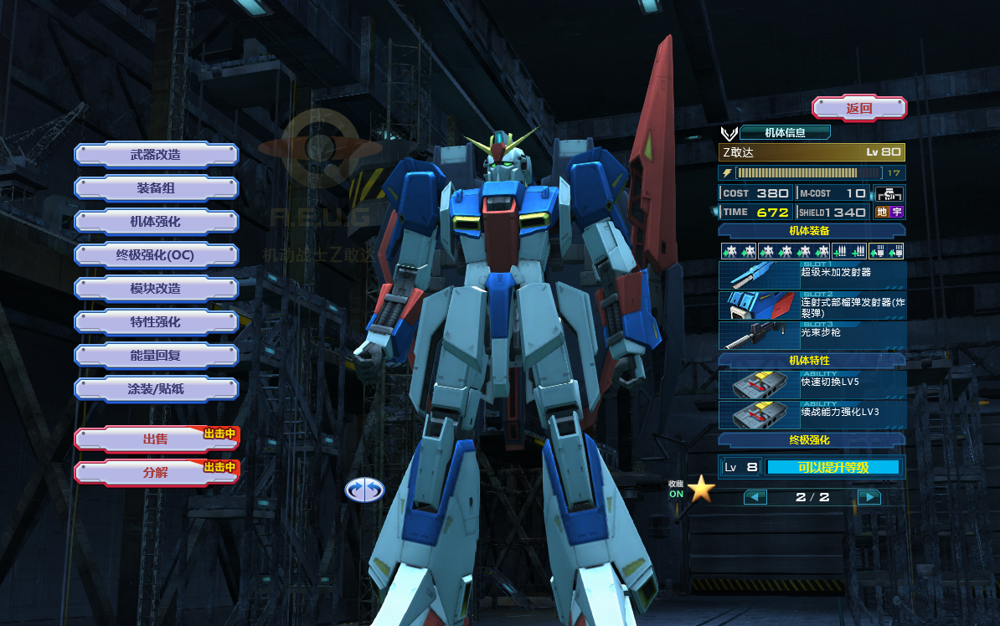
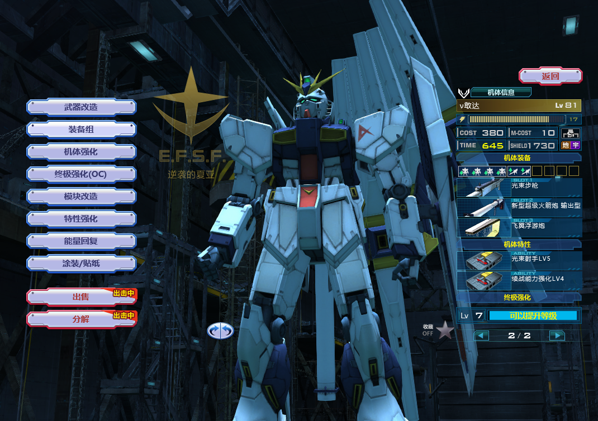
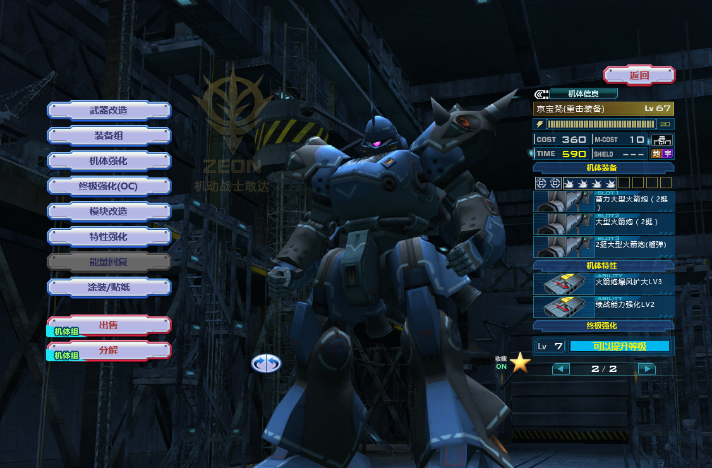
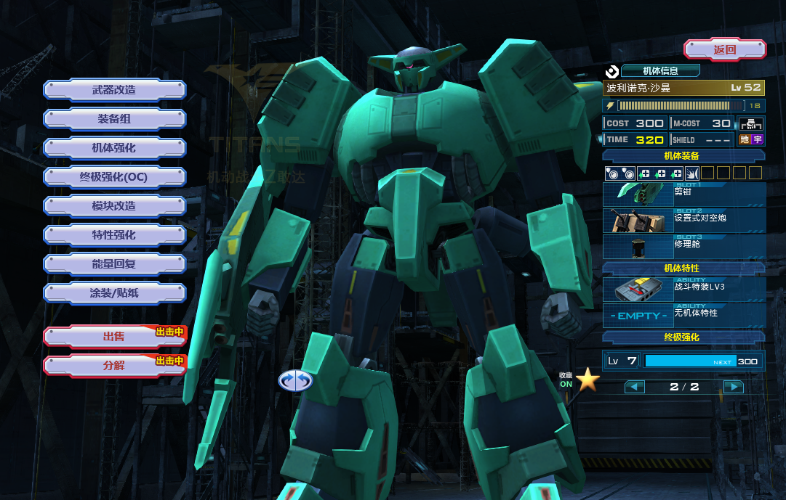
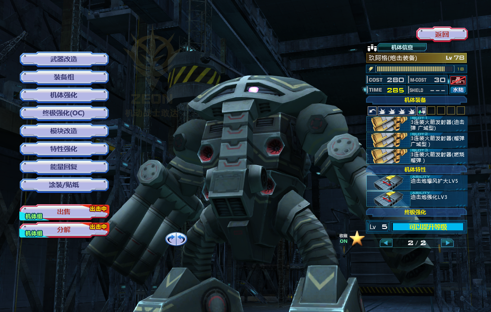
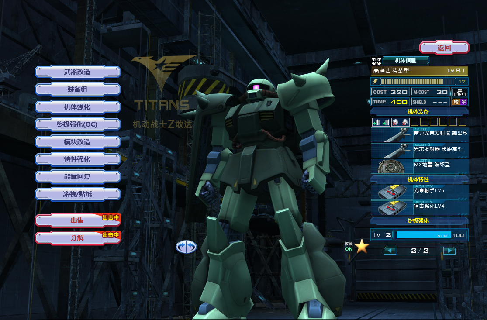

# 机动战士敢达OL 机体强化指引 
### 0083 逆袭的夏亚 2017.9
***
>以下所有的说明均不包含特殊情况或特殊玩法

## 一、属性强化
#### 机体等级
1. 尽可能高的等级以获得追加特性,其中60级可以获得3级及以下的追加特性,70级可以获得4级及以下的追加特性,80级可以获得5级及以下的追加特性
2. 强化装备搭载量会得到比强化其他属性更少的等级提升, 当需要更高等级时酌情减少该属性的强化

#### 属性优先级
1. 保持装备搭载量为正值
2. 归投属性用处很小,在不需要更高等级或非特殊机体时尽量少的强化该属性
3. 速度、气槽、回气三项属性可有效提升机体机动性，用来KD的机体应优先提升这三项数值
4. 格斗机体应优先提升气槽和回气属性
5. 炮击机体应优先强化护甲以提升生存能力(残疾车之类的除外..)
6. 黄爷依作用不同可选择优先装甲或优先机动能力(速度,气槽,回气)
7. 部分节奏感很强的机体(如重击KPF)可以更多的提升回气以改善攻击节奏
8. 带光束涂层的机体可以选择更多的强化装甲

## 二、追加特性选择
1. 用来KD的机体优先选择续战
2. 战术用机体优先选择机动力强化
3. 自身有减伤能力的机体可以选择减伤作为第二特性
4. 其他机体/没抽到上述特性的情况下优先选择提升自身输出能力的特性, 如格斗特性、迫击炮强化、光束枪化、狙击强化等
5. 其他特性基本都没啥用，看喜好选吧

## 三、模块选择
#### 模块类型简述
1. 攻击类模块:主要为改善攻击性能的模块，如增加暴风范围，增加攻击手感，减少格斗消耗，均属于此类型
2. 防御类模块:主要为增加各种状态下的伤害减免模块，以及三个NT专用预警模块
3. 移动类模块:增加地形适应性及改善移动性能，通常很少用到
4. 特殊类模块:类型较为混杂，有其特殊的应用场合
5. 辅助类模块:主要为改善操作手感的模块，如高切、高填
6. 固有模块:固有模块属于机体自带的模块, 仅部分机体拥有, 不可拆卸, 一般光束涂层、变形、机体动作性能优化等额外效果都由该类模块提供

#### 模块选择方法
+ 减少机体输出时间、改善连击能力【高速切换模块】：GP01，Zeta等需要依赖多武装组合攻击来打出输出，但是机体装备切换速度较慢的机体。
+ 刀机专用【格斗出力控制】、【格斗关节控制】：基本所有格斗机都需要插上这两个模块，可以大幅改善气槽消耗及攻击后摇
+ 增加武器手感【后坐力控制】、【移动射击辅助】：前者可以减少多联装武器攻击时的准心移动，后者可以减少自身移动时的弹道偏移，适用于任何拥有FA武装的机体
+ 希望大多数战地黄都可以带上的模块【护盾修理】：可以在修理机体时同时修理护盾，很多机体没了盾就相当于丢了大半条命，黄爷能带还是带上吧，修无盾机体时这个模块不会有任何效率上的影响
+ 依据心情选择的模块：辅助弹药、高速装填、破盾等，大部分模块都属于此类，根据个人的操作喜好选择

#### 模块选择示例
> 以下示例的模块选择并非最优选择,仅供参考, 实际选择什么模块需要根据场景和自身习惯来选择

冲刺控制2: Z3的气槽容量实在是太捉急了

锁定感知改良型: Z3的作战半径较小, 该模块可以有效提升生存能力

辅助弹药: 魔炮备弹较少, 该模块可以有效提升作战续航

高速切换: Zeta的拔枪速度..谁用谁知道..

移动射击辅助: 微量提升sa手感

快速蓄力: 让灵魂武器蓄力筒可以更快的处于就绪状态

暴风控制III: 提升全装备武器的暴风范围, 更好蹭头

护盾修理: 能修盾..

爆炸装甲: 微量提升在前线的生存能力

榴弹着弹预测: 远距离抛榴弹时不需要凭感觉了

暴风控制III: 提升榴弹和燃烧榴弹的暴风范围

后坐力控制I: 提升榴弹和燃烧榴弹的稳定性

辅助弹药: 能多打几枪

破盾II: 拿单点蹭人的时候可以对盾牌造成更多伤害

## 四、OC强化
1. 速度及回气带来的增益很小, 如果不是很缺该属性或在该属性上的提升可以带来机体性能的很大提升,应放弃提升该属性
2. 气槽及装备搭载在该版本单次强化效益较高, 应优先选择
3. 具有光束涂层/减伤状态的机体应优先提升装甲